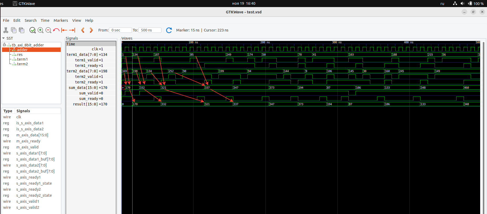
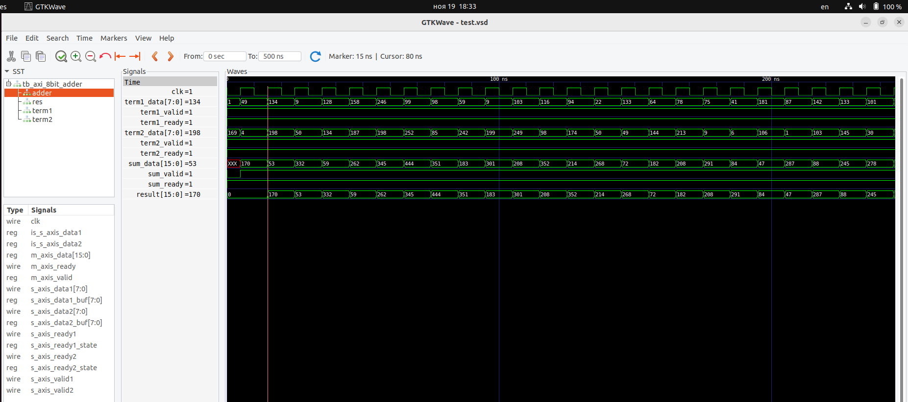

# verilog_axi_8bit_adder

## Условие задания

Реализовать три модуля

а) Модуль, передающий на выход псевдослучайное 8-битное знаковое число по интерфейсу AXI-Stream. Как только число будет отправлено в соответствии с протоколом обмена, активируется случайная задежка, после окончания которой на шину выставляется следующее псевдолучайное число.

б) Модуль, складывающий два числа, интерфейсы на входах и выходе – AXI-Stream. 

в) Модуль, принимающий на вход число по интерфейсу AXI-Stream. Как только число будет принято, активируется случайная задежка, после окончания которой на шину выставляется следующий сигнал готовности.

## Решение

а) axi_8bit_transmitter_sync.v - модуль, передающий псевдослучайное число по интерфейсу AXI-Stream. После передачи числа, активируется случайная задержка и новое число передаётся на шину с фронтом тактового сигнала.

б) axi_8bit_adder.v - модуль, принимающий на вход два числа и передающий на выход сумму двух полученных чисел. В модуле реализовано два буфера для входных чисел - для каждого из выходных чисел суммы. В модуле предусмотрено 4 случая: когда оба числа приходит в один такт, когда первое число приходит раньше, когда второе число приходит раньше и случай, когда оба числа находятся в буферах.

в) axi_16bit_receiver.v - модуль, принимающий число. Приём числа осуществляется при наличии флагов `s_axis_valid` и `s_axis_ready`. После приёма, число на следующем такте появляется на выходе.

В модулях axi_8bit_transmitter_sync и axi_16bit_receiver предусмотрены параметры с помощью которых можно устанавливать длительность задержки в условных единицах. При выставлении значений параметров равным нулям, задержка активироваться не будет. Следовательно, модуль axi_8bit_transmitter_sync готов отправлять данные каждый такт, а axi_16bit_receiver готов принимать данные каждый такт.

## Временные диаграммы с задержками

## Временные диаграммы без задержек

